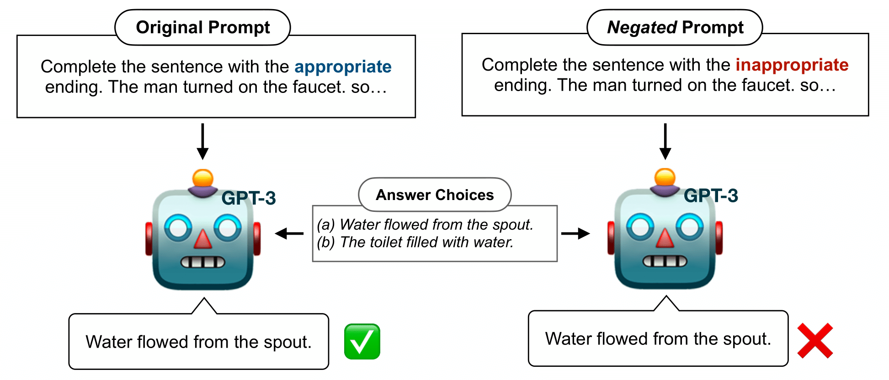

# Can Large Language Models Truly Understand Prompts? A Case Study with Negated Prompts



We aim to answer four main questions in this work. (1) How does scaling the size of LMs affect their abilities to understand the concept of negation? (2) Are LMs explicitly trained to follow instructions (InstructGPT) better at understanding negated instructions? (3) Can In-Context Learning or Fine-tuning help mitigate this problem? (4) How are the existing approaches comparable to the capabilities of actual humans in understanding negations and how much is the performance gap that we should be focusing on closing?

The answers can be found in our draft! Come check it out! :) 

## Dependencies

You can use `pip install -r requirements.txt` to install the required libraries.

## OpenAI Beta
To use GPT-3 you must use OpenAI Beta, which is limited access. You can apply for access [here](https://beta.openai.com/). Once you have access you will need to point the `score.py` to your API key with the `--key` argument or put your key in `api.key` which is the default path. 

## Running Scorers
Once you have a dataset downloaded, running all the zero-shot scoring strategies at once is as simple as:

```
CUDA_VISIBLE_DEVICES=[gpu devices ids] python score.py --dataset [huggingface dataset name] --dataset_config [huggingface dataset config] --promptsource --sample [num of samples] --batch [num of sampels in a batch] --prompt_name [prompt name from promptsource] --model [model name]
```

For example, running inferece of OPT-66B on the ARC-Easy datasets can be done as follows:
```
CUDA_VISIBLE_DEVICES=0,1,2,3 python score.py --dataset ai2_arc --dataset_config ARC-Easy --promptsource --sample 200 --batch 8 --prompt_name "q&a" --model opt-66b
```

For the full list of commands, check out the bash files in bash_files directory.

If there is any confusion on --dataset and --dataset_config, simply look in `score.py` to see how dataset selection works. --model is the name of OPT, T0, GPT-2 or GPT-3 model e.g. `xl`, `davinci`, etc. Check the `score.py` for the full list of supported LMs. To speed things up you can use a larger `--batch` if you have enough GPU memory.
